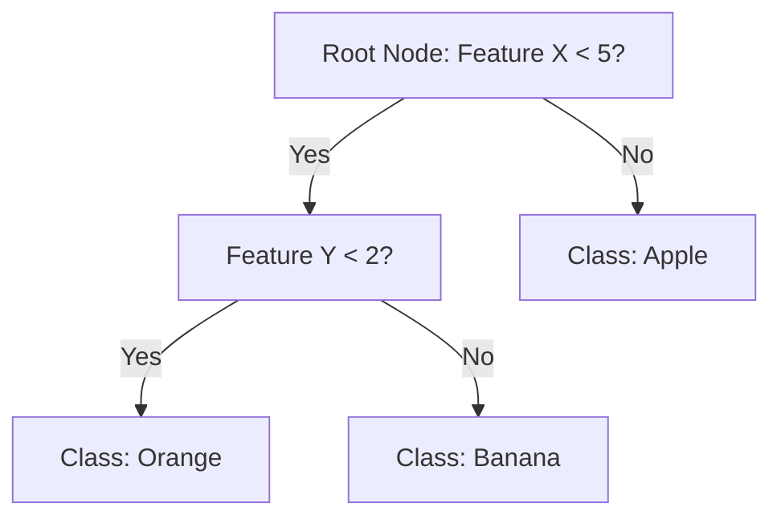

# Random Forest Algorithm

## Overview
Random Forest is an ensemble machine learning algorithm that builds multiple decision trees and merges their results to improve accuracy and control overfitting. It is widely used for both classification and regression tasks.

## How It Works
1. **Bootstrap Sampling:** Random subsets of the training data are created with replacement.
2. **Decision Trees:** For each subset, a decision tree is trained, but at each split, only a random subset of features is considered.
3. **Aggregation:** For classification, the final prediction is the mode (majority vote) of all trees. For regression, it is the average of all tree outputs.

## Advantages
- Handles large datasets with higher dimensionality
- Reduces overfitting compared to a single decision tree
- Can handle missing values

## Simple Tree Structure Example
Below is a simple illustration of a single decision tree (Random Forest builds many such trees):

## Random Forest Structure
A Random Forest consists of many such trees, each trained on different data samples and feature subsets. Their outputs are combined for the final prediction.

---

**References:**
- [Scikit-learn Random Forest Documentation](https://scikit-learn.org/stable/modules/ensemble.html#random-forests)
- [Wikipedia: Random Forest](https://en.wikipedia.org/wiki/Random_forest)
